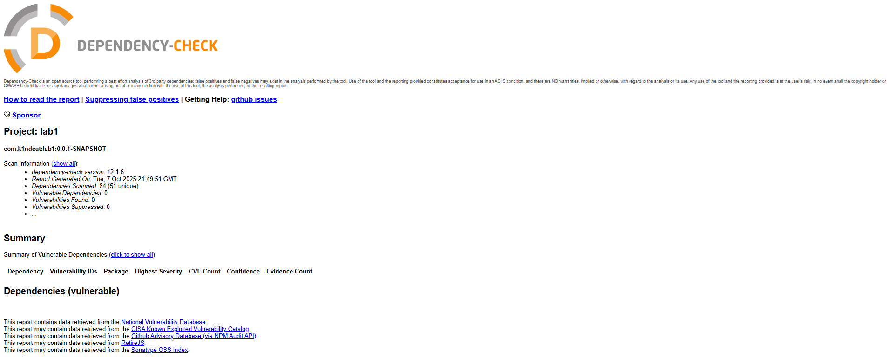

# Информационная безопасность. Лабораторная работа №1

Технологии: Spring Boot/Java

## Методы API

### Авторизация пользователя

**POST** `/api/auth/login`

Аутентифицирует пользователя по логину и паролю и возвращает JWT токен доступа для работы с защищёнными ресурсами API.

#### Тело запроса:

Формат: `application/json`
```json
{
"username": "username",
"password": "password"
}
```

В случае успешной авторизации возвращается JWT токен доступа:
```json
{
  "accessToken": "eyJhbGciOiJNCqb2huX2..."
}
```

#### Ошибки:

- В случае если логин и/или пароль не верны, возвращается ошибка:

Код ответа: **403 Forbidden**

### Регистрация пользователя

**POST** `/api/auth/register`

Регистрирует пользователя по логину и паролю и возвращает JWT токен доступа для работы с защищёнными ресурсами API.

#### Тело запроса:

Формат: `application/json`
```json
{
"username": "username",
"password": "password"
}
```

В случае успешной регистрации возвращается JWT токен доступа:
```json
{
  "accessToken": "eyJhbGciOiJNCqb2huX2..."
}
```

#### Ошибки:

- В случае если пользователь с заданным username уже существует, возвращается ошибка:

Код ответа: **403 Forbidden**

### Получение списка товаров

**GET** `/api/data`

Возвращает пагинированный список товаров.

#### Параметры запроса (query):

- `page` (integer, по умолчанию 0) — Номер страницы (начиная с 0).
- `size` (integer, по умолчанию 10) — Размер страницы.

#### Пример успешного ответа:
```json
{
  "totalElements": 0,
  "totalPages": 0,
  "size": 0,
  "content": [
    {
      "id": 1,
      "title": "Умная лампочка",
      "description": "Лампочка с управлением через Wi-Fi и поддержкой смартфонов",
      "price": 1299.99
    }
  ],
  "number": 0,
  "sort": {
    "empty": true,
    "sorted": true,
    "unsorted": true
  },
  "first": true,
  "last": true,
  "numberOfElements": 0,
  "pageable": {
    "offset": 0,
    "sort": {
      "empty": true,
      "sorted": true,
      "unsorted": true
    },
    "pageSize": 0,
    "pageNumber": 0,
    "paged": true,
    "unpaged": true
  },
  "empty": true
}
```

#### Ошибки:

- В случае если пользователь не авторизован, возвращается ошибка:

Код ответа: **403 Forbidden**

## Описание реализованных мер защиты

### 1. Защита от SQLi

Для защиты от SQL-инъекций в проекте используется Spring Data JPA, благодаря чему происходит автоматическое экранирование всех параметров запросов. И всё взаимодействие с базой данных осуществляется только через `JpaRepository`.
Пример [UserRepository.java](src/main/java/com/k1ndcat/lab1/repository/UserRepository.java):
```java
@Repository
public interface UserRepository extends JpaRepository<User, Integer> {

    Optional<User> findByUsername(String username);

    Boolean existsByUsername(String username);
}
```

### 2. Защита от XXS

В проекте реализована базовая защита от XSS на уровне HTTP-заголовков средствами Spring Security:

* Заголовок X-XSS-Protection устанавливается вручную с параметром "1; mode=block", который активирует встроенный XSS-фильтр браузера и блокирует выполнение подозрительных скриптов на клиенте.

* Заголовок Content-Security-Policy с директивой "script-src 'self'" ограничивает загрузку и выполнение скриптов только с того же источника, уменьшая риск выполнения внешних вредоносных скриптов.

Пример конфигурации [SecurityConfig.java](src/main/java/com/k1ndcat/lab1/config/SecurityConfig.java):
```java
.headers(headers -> headers
        .addHeaderWriter((request, response) -> response.setHeader("X-XSS-Protection", "1; mode=block"))
        .contentSecurityPolicy(csp -> csp.policyDirectives("script-src 'self'"))
)
```

### 3. Аутентификация

Аутентификация реализована с использованием JWT. При успешной аутентификации, пользователь получает токен, который в последующем должен быть включён в заголовок `Authorization` запроса для доступа к защищённым ресурсам. Защиту ресурсам обеспечивает Spring Security.

Пример [SecurityConfig.java](src/main/java/com/k1ndcat/lab1/config/SecurityConfig.java):
```java
.authorizeHttpRequests(auth -> auth
        .requestMatchers("/api/auth/**").permitAll()
        .anyRequest().authenticated()
)
.sessionManagement(session -> session
        .sessionCreationPolicy(SessionCreationPolicy.STATELESS)
)
.authenticationProvider(authenticationProvider)
.addFilterBefore(jwtAuthFilter, UsernamePasswordAuthenticationFilter.class);
```

## Скриншот отчёта OWASP



## Ссылка на последний успешный запуск pipeline в репозитории

[Pipeline Run](https://github.com/k1nd-cat/information-security-itmo/actions/runs/18327147067)